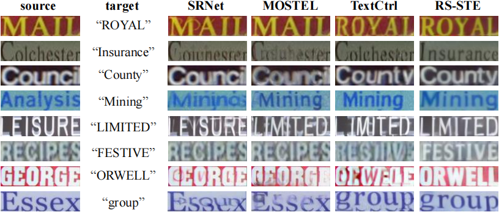

# Recognition-Synergistic Scene Text Editing 🎨✨
[](https://arxiv.org/abs/2503.08387)

**CVPR 2025 | ​Official Implementation**
This is a official implementation of RS-STE proposed by our paper Recognition-Synergistic Scene Text Editing (CVPR 2025).

<div style="text-align: center;">
    
</div>

---
## 🚧 Under Construction 🚧
We're currently polishing the code and preparing everything for public release. Here's what you can expect in the near future:
**TODO List ✅**
- [ ] **Code Release**: Clean and document the core implementation.  
- [ ] **Pre-trained Models**: Upload models for easy inference.  
- [ ] **Dataset Tools**: Provide scripts for dataset preparation.  
- [ ] **Demo**: Create a user-friendly demo for quick testing.  
- [ ] **Documentation**: Write detailed usage instructions and technical explanations.  

Stay tuned! We'll update this repository step by step. ⏳

---

## 0️⃣ Install

**Environment🌄**

```
conda create -n rsste python=3.8
conda activate rsste
# Our CUDA version is 11.4
pip install torch==1.12.1+cu113 torchvision==0.13.1+cu113 torchaudio==0.12.1 --extra-index-url https://download.pytorch.org/whl/cu113
pip install -r requirements.txt

```

## 1️⃣ Dataset 
Organize the annotation file into the following format and save it directly to ```data/annotation```:
```
import pickle
data = {
    "image1_paths":['example_data/3.png', 'example_data/47.png', 'example_data/81.png', 'example_data/91.png', 'example_data/106.png', 'example_data/133.png'],
    "image2_paths":[], # (Optional, needed during pretraining stage with paired images.)
    "image1_rec":['MAIL', 'Colchester', 'Council', 'Analysis', 'LEISURE', 'RECIPES'], # (Optional, needed during all the training stage)
    "image2_rec":['ROYAL', 'Insurance', 'County', 'Mining', 'LIMITED', 'FESTIVE']
}
with open("data/annotation/inference_annotations.pkl", "wb") as f:
    pickle.dump(data, f)
```


## 2️⃣ Inference
[Pretrained Model Download](https://pan.baidu.com/s/151EXQY5SdpETd3BS62dJYQ?pwd=db8s).
##  Training

## Citation